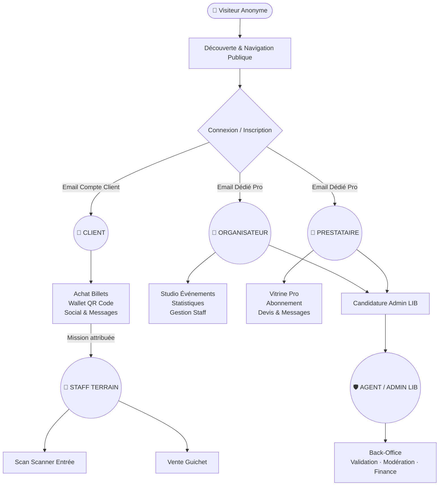
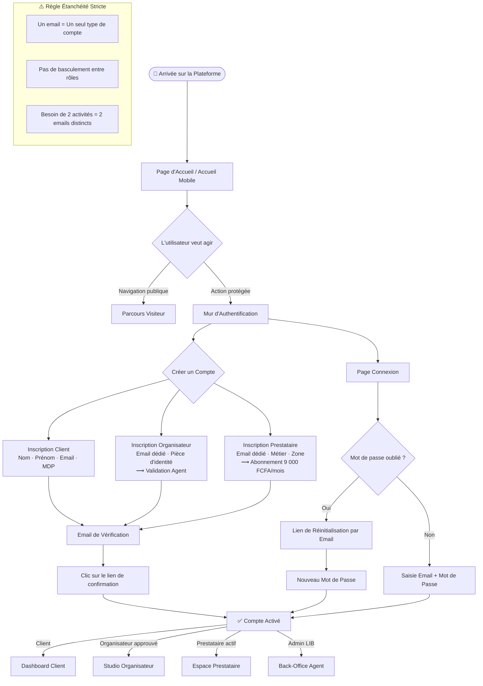
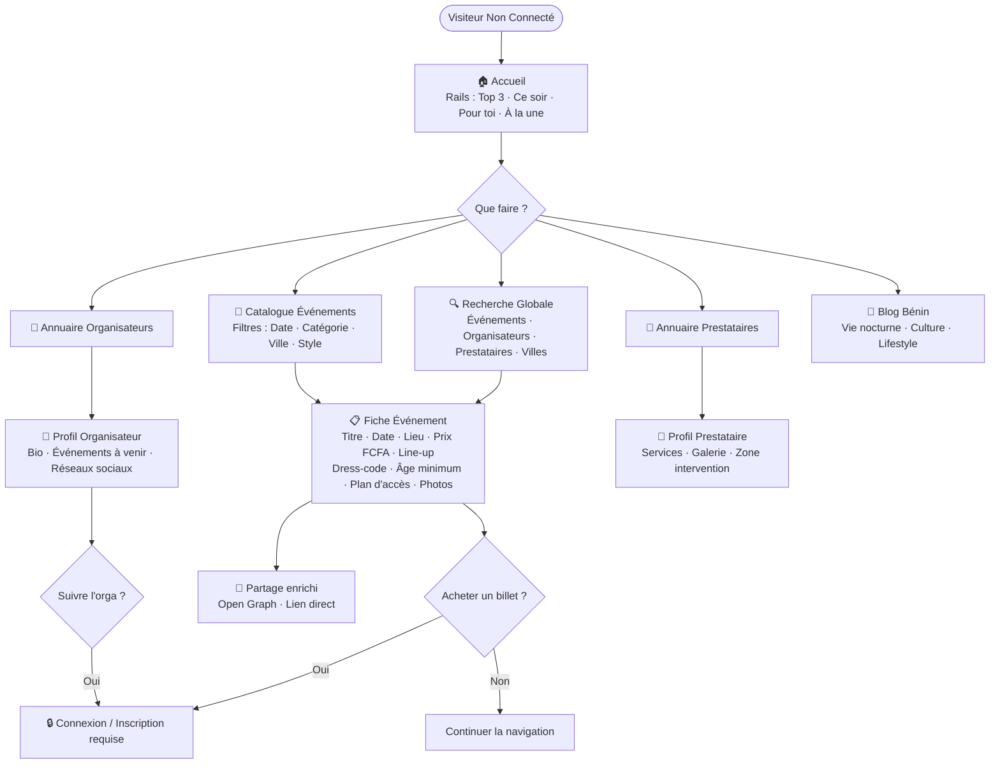
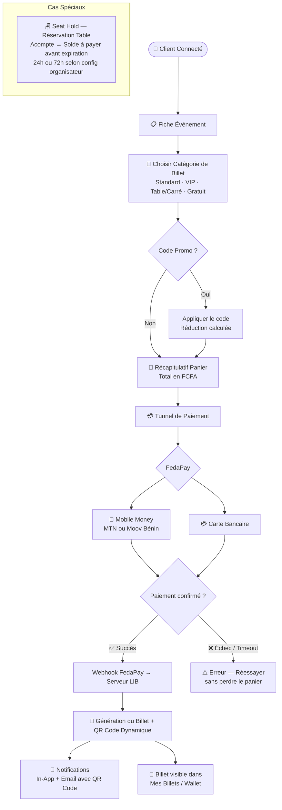
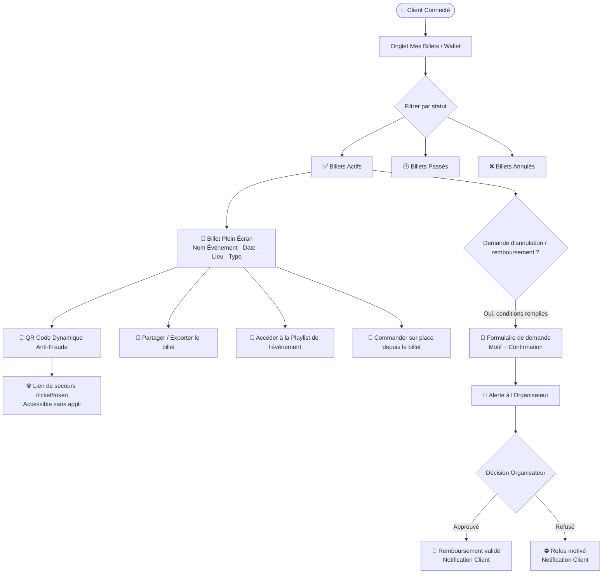
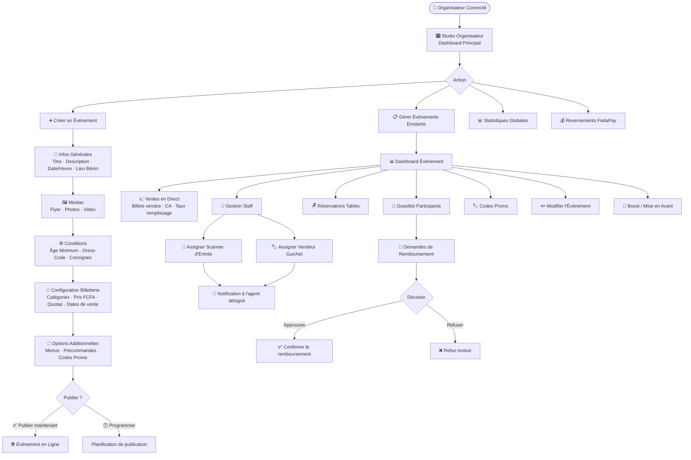
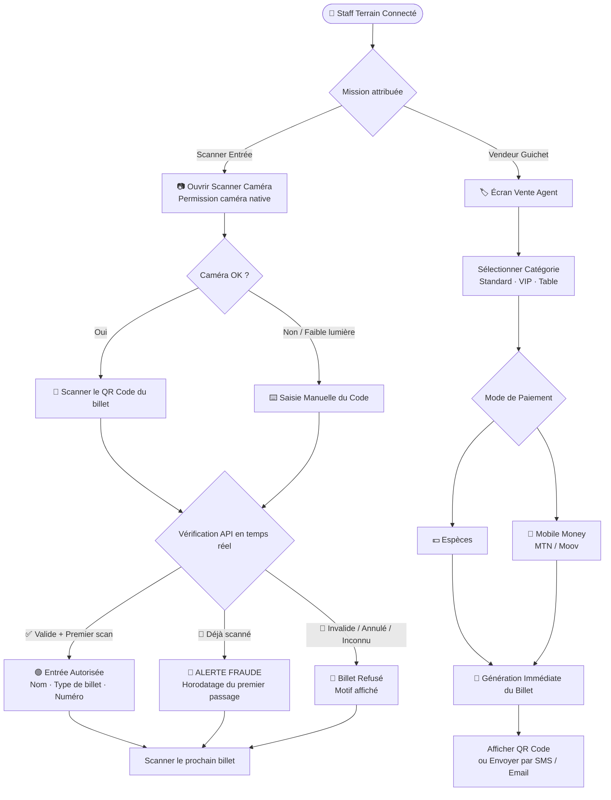
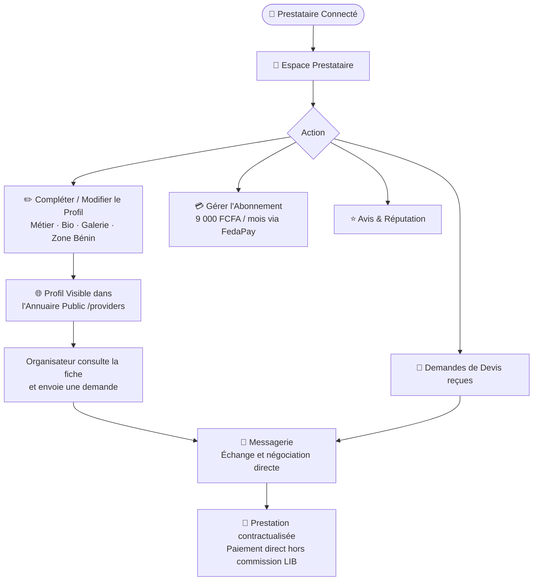
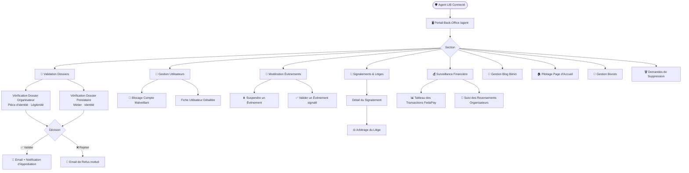
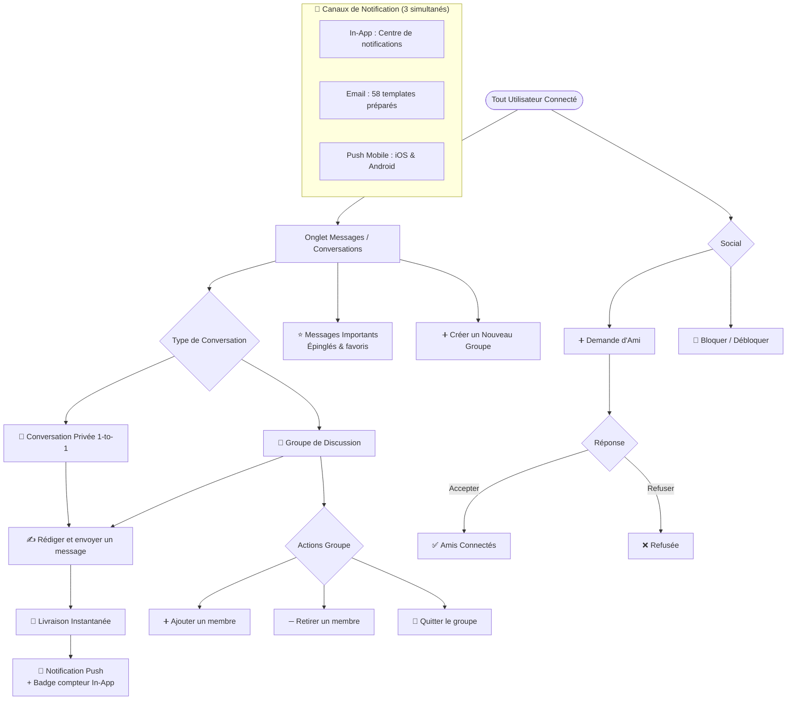

# 🗺️ CARTE COMPLÈTE DES USER FLOWS — LIVE IN BLACK
**Marché : Bénin 🇧🇯 | Devise : FCFA | Paiement : FedaPay**
*Version 1.0 — 12 Septembre 2026*

---

## 🧭 CARTE MACRO : Vue Globale du Système



---

## 🔐 FLOW 1 — Authentification & Séparation des Comptes



---

## 🧑 FLOW 2 — Visiteur Anonyme (Découverte)



---

## 🎟️ FLOW 3 — Client : Achat de Billet (Tunnel Complet)



---

## 👛 FLOW 4 — Client : Gestion du Portefeuille de Billets (Wallet)



---

## 🎪 FLOW 5 — Organisateur : Création & Gestion d'Événement



---

## 🔦 FLOW 6 — Staff Terrain : Contrôle d'Accès & Vente Guichet (Jour J)



---

## 🎵 FLOW 7 — Prestataire de Services



---

## 🛡️ FLOW 8 — Agent / Administrateur LIB (Back-Office)



---

## 💬 FLOW 9 — Messagerie & Notifications (Transversal à tous les rôles)



---

## 📊 FLOW 10 — Synthèse des Correspondances Écrans Web ↔ Mobile

```mermaid
graph LR
    subgraph "WEB (Next.js / Vercel)"
        W1[/home]
        W2[/events · /events/id]
        W3[/organizers · /organizers/slug]
        W4[/providers · /providers/id]
        W5[/profile/billets]
        W6[/ticket/token]
        W7[/checkout/eventId]
        W8[/scanner/eventId]
        W9[/on-site-sales/eventId]
        W10[/messages]
        W11[/organizer-studio]
        W12[/my-events/id/statistiques]
        W13[/offer-services]
        W14[/agent/*]
    end

    subgraph "MOBILE (React Native / Expo)"
        M1[tabs/index]
        M2[app/event/id]
        M3[app/organizer/slug]
        M4[app/provider/id]
        M5[tabs/tickets]
        M6[order/eventId/code]
        M7[checkout/eventId]
        M8[scanner.tsx caméra native]
        M9[agent-sales/eventId]
        M10[tabs/messages · conversation/id]
        M11[spaces/organizer.tsx]
        M12[spaces/organizer/eventId/stats]
        M13[spaces/provider.tsx]
        M14[spaces/agent.*]
    end

    W1 <-.->|Équivalent| M1
    W2 <-.->|Équivalent| M2
    W3 <-.->|Équivalent| M3
    W4 <-.->|Équivalent| M4
    W5 <-.->|Équivalent| M5
    W6 <-.->|Lien de secours| M6
    W7 <-.->|Équivalent| M7
    W8 <-.->|Équivalent| M8
    W9 <-.->|Équivalent| M9
    W10 <-.->|Équivalent| M10
    W11 <-.->|Équivalent| M11
    W12 <-.->|Équivalent| M12
    W13 <-.->|Équivalent| M13
    W14 <-.->|Mobile partiel| M14
```

---

## 📌 RÉSUMÉ EXÉCUTIF (Pour Validation Client)

| Flow | Parcours | Statut |
| :--- | :--- | :---: |
| 1 | Authentification & Séparation des Comptes | ✅ Opérationnel |
| 2 | Visiteur Anonyme — Découverte & Navigation Publique | ✅ Opérationnel |
| 3 | Client — Tunnel d'Achat FedaPay (Billetterie FCFA) | ✅ Opérationnel |
| 4 | Client — Portefeuille de Billets & QR Code | ✅ Opérationnel |
| 5 | Organisateur — Création, Gestion & Dashboard Événement | ✅ Opérationnel |
| 6 | Staff Terrain — Scanner d'Entrée & Vente Guichet (Jour J) | ✅ Opérationnel |
| 7 | Prestataire — Vitrine, Abonnement & Mise en Relation | ✅ Opérationnel |
| 8 | Agent / Admin LIB — Back-Office & Modération | ✅ Opérationnel |
| 9 | Messagerie, Social (Amis) & Notifications Multi-canaux | ✅ Opérationnel |
| 10 | Correspondance complète Écrans Web ↔ Mobile (67 écrans) | ✅ Cartographié |
