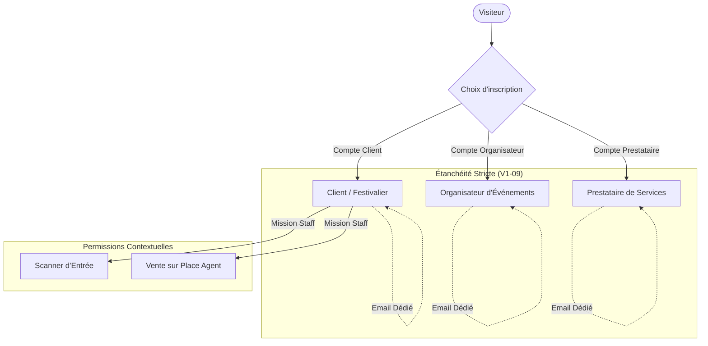
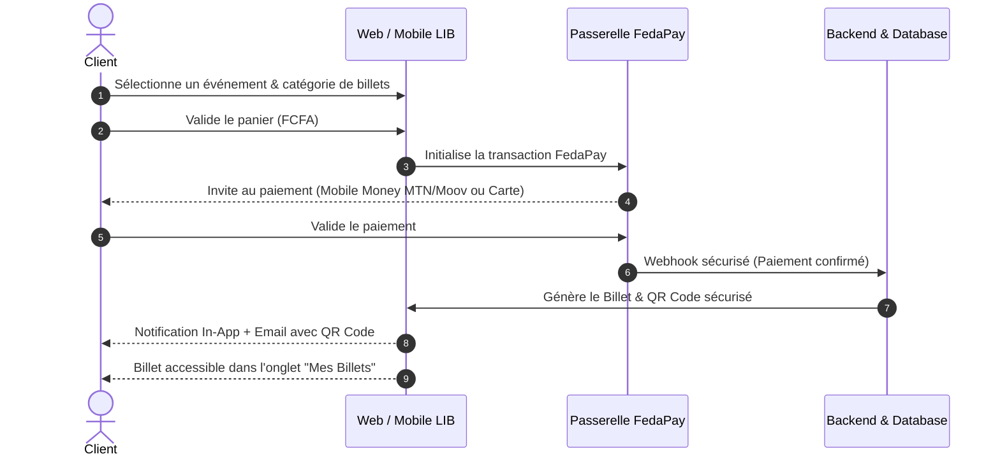
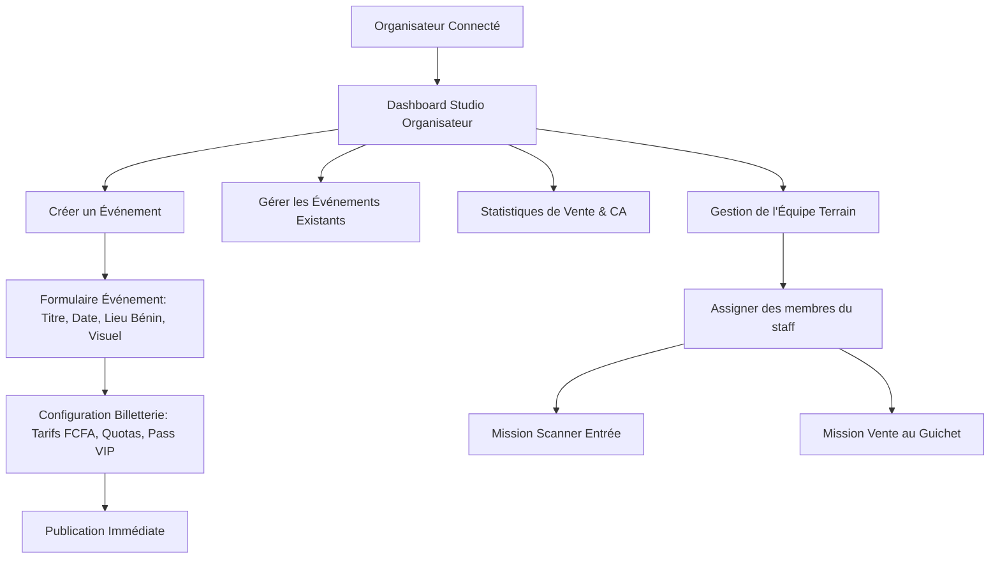
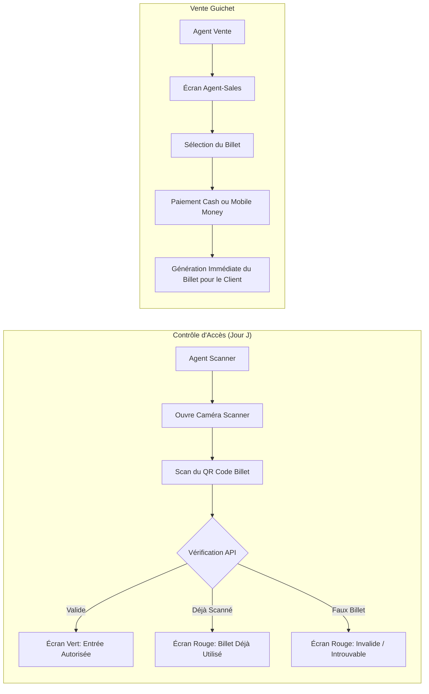
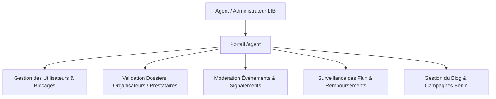

# Cartographie Complète des User Flows — LIVE IN BLACK (Web & Mobile)

**Date d'arrêté :** 12 Septembre 2026  
**Objectif :** Formaliser l'intégralité des parcours utilisateurs (User Flows) par rôle pour servir de document de référence et de validation avec le porteur de projet (Chady Hage).

---

## 1. Architecture Générale des Rôles & Comptes (Règle d'Étanchéité)

---

## 2. Parcours Visiteur & Authentification

### 2.1 Visiteur non connecté (Découverte)
1. **Arrivée sur la plateforme** (`/home` ou Accueil Mobile).
2. **Consultation du catalogue événementiel** (Filtres par date, catégorie, ville - Focus Bénin).
3. **Recherche unifiée** (Recherche textuelle d'événements, d'organisateurs ou de prestataires).
4. **Consultation de fiche détaillée :**
   * Fiche Événement : Détails, line-up, localisation sur carte, catégories de billets, tarifs en FCFA.
   * Fiche Organisateur : Biographie, événements à venir, réseaux sociaux.
   * Fiche Prestataire : Services proposés, galerie, zone d'intervention.
5. **Action nécessitant une authentification** (Achat de billet, suivi d'un organisateur, envoi d'un message) $\rightarrow$ Redirection vers le parcours de connexion.

### 2.2 Parcours Authentification & Séparation des Comptes
* **Connexion (`/login`) :**
  * Saisie Email + Mot de passe.
  * Option "Mot de passe oublié" $\rightarrow$ Email avec lien sécurisé de réinitialisation (`/reset-password`).
  * Redirection automatique selon le type de compte vers le tableau de bord approprié.
* **Inscription Client :** Formulaire simplifié (Nom, Prénom, Email, Mot de passe sécurisé, Téléphone béninois +229 optionnel).
* **Inscription Organisateur (`/organizer-signup`) :**
  * Formulaire dédié (Nom structure / Nom commercial, Email dédié, Pièce d'identité du titulaire).
  * Soumission du dossier $\rightarrow$ Statut "En attente de validation agent".
* **Inscription Prestataire (`/provider-signup`) :**
  * Formulaire dédié (Nom commercial, Type de service, Localisation, Justificatif d'identité).
  * Sélection du forfait d'abonnement (9 000 FCFA/mois).

---

## 3. Parcours Utilisateur : Client / Festivalier

### 3.1 Découverte & Interaction Sociale
* **Suivi d'organisateurs :** Clic sur "Suivre" $\rightarrow$ Ajout dans `/profile/followed-organizers` + réception des notifications pour les nouveaux événements.
* **Mise en favoris :** Sauvegarde d'événements intéressants $\rightarrow$ Retrouvés dans `/profile/interested-events`.
* **Messagerie :** Discussion privée avec des amis ou contact direct d'un prestataire/organisateur.

### 3.2 Cycle de vie du Billet (Wallet & Événement)
* **Accès au billet :** Onglet "Mes Billets" $\rightarrow$ Affichage du billet numérique avec QR Code dynamique anti-fraude.
* **Page publique de secours :** Lien sécurisé `/ticket/[token]` accessible même hors connexion à l'application.
* **Demande de remboursement :**
  * Soumission via le billet (si l'organisateur autorise le remboursement ou en cas de report/annulation).
  * Notification transmise à l'organisateur.

---

## 4. Parcours Professionnel : Organisateur d'Événements

### 4.1 Gestion des Événements & Billetterie
* **Création / Édition :** Titre, description, date/heure, adresse précise au Bénin, dress-code, âge minimum.
* **Paramétrage des billets :** Quotas de places par type (Standard, VIP, Carré/Table), prix en FCFA, dates d'ouverture/fermeture des ventes.
* **Gestion des réservations VIP (Seat Hold) :** Validation des acomptes et solde des tables réservées.

### 4.2 Suivi Opérationnel & Clôture
* **Statistiques en direct :** Nombre de billets vendus, chiffre d'affaires cumulé, taux de présence (scans effectués).
* **Gestion des litiges / Remboursements :** Approbation ou rejet motivé des demandes de remboursement des clients.

---

## 5. Parcours Outils Terrain : Contrôle d'Accès & Ventes sur Place (Staff)

---

## 6. Parcours Prestataire de Services

1. **Activation du Profil :**
   * Complétion de la fiche vitrine (métiers : DJ, Sonorisation, Traiteur, Sécurité, Lieu, etc.).
   * Souscription à l'abonnement mensuel (9 000 FCFA).
2. **Mise en Relation :**
   * Réception des demandes de devis et messages d'organisateurs d'événements.
   * Négociation via la messagerie instantanée.
3. **Visibilité :** Présence dans l'annuaire public `/providers` filtrable par métier et localité.

---

## 7. Parcours Back-Office : Administration & Modération (Agent LIB)

---

## 8. Synthèse d'Équivalence Fonctionnelle (Web vs Mobile)

| Fonctionnalité | Parcours Web | Parcours Mobile | Statut Technique |
| :--- | :---: | :---: | :---: |
| **Découverte & Recherche** | `/home`, `/events`, `/search` | `(tabs)/index`, `(tabs)/search` | ✅ Opérationnel |
| **Achat Billetterie (FCFA)** | Tunnel de paiement complet | `app/checkout/[eventId]` | ✅ Opérationnel |
| **Portefeuille de Billets** | `/profile/billets`, `/ticket/[token]` | `(tabs)/tickets`, `order/[id]/[code]` | ✅ Opérationnel |
| **Scanner QR Code Staff** | `/scanner/[eventId]` | `app/scanner.tsx` (Caméra native) | ✅ Opérationnel |
| **Vente Agent Guichet** | `/on-site-sales/[eventId]` | `app/agent-sales/[eventId]` | ✅ Opérationnel |
| **Messagerie & Groupes** | `/messages` | `(tabs)/messages`, `conversation/[id]` | ✅ Opérationnel |
| **Studio Organisateur** | `/organizer-studio`, `/my-events` | `app/spaces/organizer` | ✅ Opérationnel |
| **Espace Prestataire** | `/offer-services` | `app/provider/[id]`, `app/spaces/` | ✅ Opérationnel |
| **Supervision / Back-Office** | Espace `/agent/*` (10 écrans) | Écrans de consultation clés | ✅ Opérationnel |
