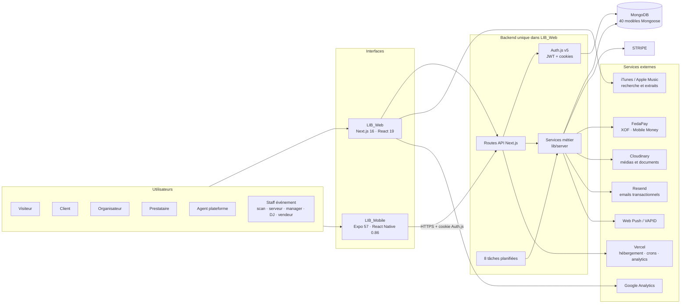
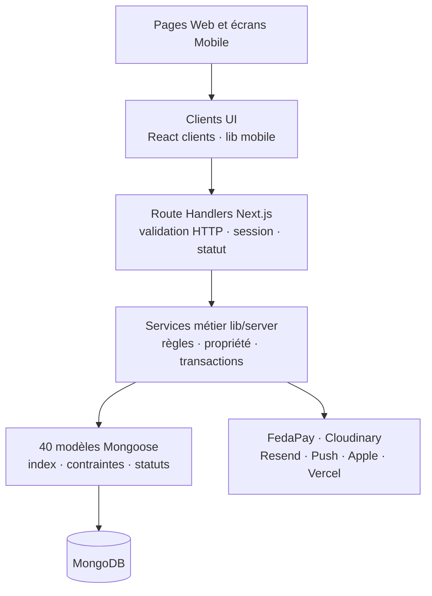
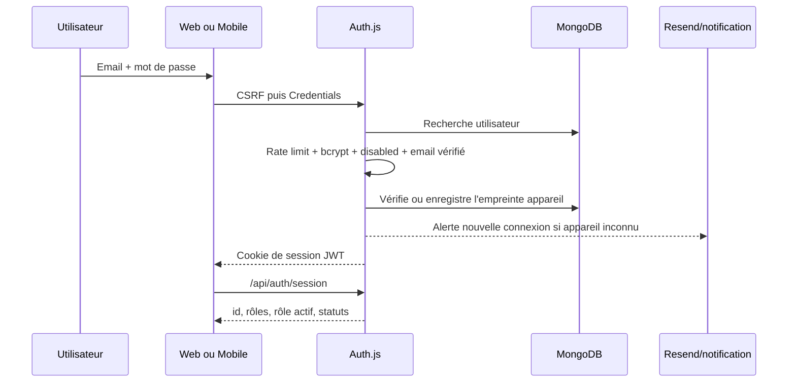
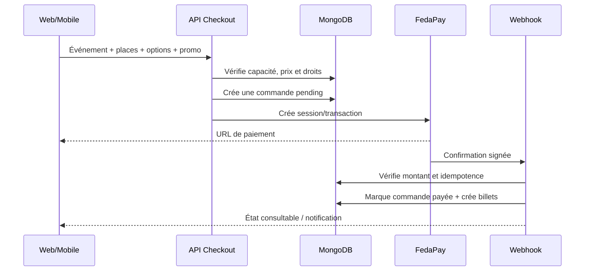
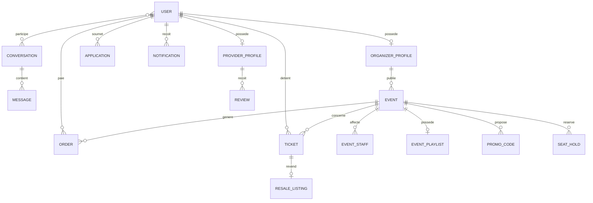

# LIVE IN BLACK — Architecture complète du système

> Document de référence technique et fonctionnel, établi à partir du code des dépôts `LIB_Web` et `LIB_Mobile` le 21 août 2026.
>
> Objectif : permettre de comprendre le produit de bout en bout — interfaces, rôles, actions, API, données, intégrations, sécurité, paiements et exploitation.

## 1. Résumé en une phrase

LIVE IN BLACK est une plateforme événementielle multi-rôles composée d'un site Web Next.js qui contient aussi le backend, d'une application mobile Expo/React Native qui consomme ce même backend, d'une base MongoDB, et de services externes pour les paiements, médias, emails, notifications, analytics et déploiement.

## 2. Vue générale du système

### Principe central

- `LIB_Web` est à la fois le frontend Web et le backend de toute la plateforme.
- `LIB_Mobile` n'a ni base de données ni serveur métier propre : il appelle `https://liveinblack.com/api/*` en production.
- Web et Mobile partagent donc les mêmes comptes, événements, billets, conversations, paiements et règles d'autorisation.
- Les règles de sécurité réelles sont côté API et services serveur. Les protections de navigation Web/Mobile améliorent l'expérience, mais ne remplacent jamais les contrôles serveur.

## 3. Les deux dépôts

| Élément | `LIB_Web` | `LIB_Mobile` |
|---|---|---|
| Mission | Site public, dashboards, API, logique métier, webhooks, crons | Application iOS/Android et export Web Expo |
| Framework | Next.js 16.2.10, App Router | Expo 57, Expo Router |
| UI | React 19.2.4, CSS Modules et styles du projet | React Native 0.86, composants mobiles partagés |
| Langage | TypeScript | TypeScript |
| Auth | Auth.js v5, Credentials, JWT | Handshake Auth.js puis cookie stocké dans SecureStore |
| Données | MongoDB via Mongoose + adaptateur MongoDB Auth.js | Aucune base locale métier ; cache d'interface et SecureStore uniquement |
| Déploiement | Vercel, sortie `standalone`, régions `cdg1` et `iad1` | EAS Build ; package Android `com.liveinblack.app`, bundle iOS `com.liveinblack.app` |
| URL API production | Interne, même origine | `https://liveinblack.com` |
| Navigation | 55 pages `page.tsx` + routes modales | 67 écrans fonctionnels audités, 5 onglets principaux |
| API | 218 fichiers de routes, environ 262 handlers HTTP déclarés | Clients TypeScript par domaine appelant l'API Web |

## 4. Architecture en couches

### Responsabilité de chaque couche

1. **Interface** : affiche l'état, recueille les actions et applique les restrictions de navigation visibles.
2. **Client réseau** : construit les requêtes, transmet le cookie de session, normalise les erreurs et les timeouts.
3. **Route API** : parse et valide la requête, vérifie la session, choisit le service métier et transforme le résultat en réponse HTTP.
4. **Service métier** : porte les règles importantes — rôle actif, propriété, capacité, états autorisés, idempotence et transactions.
5. **Modèle** : garantit les formes, index, unicités et relations stockées dans MongoDB.
6. **Intégration externe** : ne reçoit que les opérations décidées par le domaine ; les webhooks confirment les résultats asynchrones.

## 5. Authentification et compte multi-rôles

### 5.1 Modèle du compte

Un utilisateur possède :

- `roles[]` : tous ses rôles autorisés parmi `client`, `organisateur`, `prestataire`, `agent` ;
- `activeRole` : l'unique interface active à un instant donné ;
- `status` : état global `active`, `pending` ou `rejected` ;
- `orgStatus` : état propre au rôle organisateur `none`, `pending`, `active`, `rejected` ;
- `prestStatus` : même cycle pour le rôle prestataire ;
- `disabled` et `sessionVersion` : suspension et révocation des sessions existantes ;
- `superAdmin` : attribut stocké, distinct du rôle d'agent, sans espace UI autonome identifié.

**Règle fondamentale :** les autorisations utilisent `activeRole`, pas simplement la présence d'une valeur dans `roles[]`.

Exemple : un compte qui possède `['client', 'organisateur']` ne peut acheter un billet que lorsque `activeRole === 'client'`. Il doit basculer vers l'espace organisateur pour gérer ses événements.

### 5.2 Connexion

- Le fournisseur d'identité est uniquement email/mot de passe ; aucun social login n'est configuré.
- Les mots de passe sont hachés avec `bcryptjs`.
- La connexion est limitée à 10 tentatives par 15 minutes pour un couple IP/email.
- Un client pur doit avoir vérifié son email.
- Les comptes organisateur/prestataire en candidature peuvent se connecter afin de suivre leur dossier.
- Le JWT est périodiquement revérifié en base toutes les 5 minutes pour détecter suspension, suppression ou changement de version de session.
- Sur mobile natif, l'application reproduit le mécanisme CSRF d'Auth.js et stocke seulement la paire du cookie de session dans `expo-secure-store`.
- Sur Expo Web, les cookies navigateur et CORS avec credentials sont utilisés.

## 6. Rôles, permissions et actions

### 6.1 Matrice principale

| Action | Visiteur | Client actif | Organisateur actif | Prestataire actif | Agent actif |
|---|:---:|:---:|:---:|:---:|:---:|
| Voir événements, organisateurs, prestataires | Oui | Oui | Oui | Oui | Oui |
| Créer un compte / se connecter | Oui | — | — | — | — |
| Réserver ou acheter un billet | Non | Oui | Non | Non | Non |
| Voir portefeuille et QR personnels | Non | Oui | Selon billets du compte, mais l'achat exige le rôle client | Idem | Non métier |
| Marquer un événement comme intéressé | Non | Oui | Non selon rôle actif | Non selon rôle actif | Non |
| Suivre un organisateur | Non | Oui | Non | Non | Non |
| Commander une prestation | Non | Oui | Oui | Non | Oui |
| Créer/gérer un événement | Non | Non | Oui si dossier autorisé | Non | Oui côté administration |
| Gérer page et paiements organisateur | Non | Non | Oui | Non | Supervision |
| Proposer des services | Non | Non | Non | Oui si statut autorisé | Supervision |
| Administrer/modérer la plateforme | Non | Non | Non | Non | Oui |
| Scanner des billets | Non | Non | Oui | Non | Oui |
| Messagerie | Non | Oui | Oui | Oui | Oui |
| Voir un portefeuille métier | Non | Oui | Oui | Oui | Non |

### 6.2 Visiteur public

- Parcourir et filtrer les événements.
- Consulter le détail, les tarifs, médias, menu et organisateur.
- Rechercher globalement.
- Consulter les annuaires et profils organisateur/prestataire.
- Débloquer un événement privé avec un code.
- Lire le blog, la présentation, l'aide de contact et les pages légales.
- Gérer le consentement cookies.
- Créer un compte client ou commencer une candidature professionnelle.

### 6.3 Client

- Acheter un billet payant en XOF via FedaPay.
- Distinguer invitations/guestlists des événements entièrement gratuits, exclus de la V1.
- Réserver une place par acompte : 5 % pour 24 h ou 10 % pour 72 h, puis payer le solde.
- Acheter en groupe et gérer les invitations/assignations de places.
- Ajouter une protection annulation lors de l'achat.
- Afficher le billet et son QR code.
- Revendre un billet dans la bourse officielle et retirer l'annonce.
- Acheter un billet revendu, avec invalidation/réémission du QR.
- Demander un remboursement selon les critères autorisés.
- Suivre des organisateurs et gérer leurs alertes.
- Marquer des événements comme intéressants.
- Gérer profil, avatar, téléphone, démographie facultative, préférences et confidentialité.
- Exporter ses données et demander la suppression du compte.
- Gérer amis, blocages, signalements et présence.
- Utiliser conversations directes/groupes, réactions, sondages, pièces jointes, vocaux, transfert, favoris et accusés de lecture.
- Noter un prestataire, modifier/supprimer son avis et signaler un avis abusif.
- Participer à la playlist d'un événement selon les règles de l'événement.

### 6.4 Organisateur

- Créer/soumettre un dossier avec justificatifs privés et suivre la décision.
- Construire sa page publique : identité, description, avatar, couverture, médias, réseaux et zones.
- Configurer les numéros Mobile Money et références FedaPay utiles au versement.
- Créer et modifier un événement complet : lieu, dates, places, tarifs, menu, artistes, médias, vidéo, confidentialité et codes d'accès.
- Annuler ou reporter l'événement.
- Consulter réservations et statistiques.
- Gérer guestlist et codes promotionnels.
- Gérer le staff et ses permissions opérationnelles.
- Booster un événement dans la limite des slots disponibles.
- Suivre les reversements et demander un versement.
- Piloter les commandes de consommation liées à l'événement.

### 6.5 Prestataire

- Créer/soumettre un dossier professionnel et suivre son statut.
- Gérer sa page publique, catégories, zones d'intervention et médias.
- Gérer un catalogue : création, édition, disponibilité, suppression, prix, unité et médias.
- Recevoir des demandes depuis une fiche catalogue via la messagerie.
- Consulter et répondre aux avis reçus ; signaler les abus.
- Gérer l'abonnement prestataire et son historique de paiement.
- Ne peut pas commander une prestation à un autre prestataire lorsque ce rôle est actif.

### 6.6 Agent plateforme

- Voir les métriques globales : utilisateurs, événements, billets, activité et revenus plateforme.
- Examiner les candidatures, ajouter une note et approuver/rejeter.
- Gérer les utilisateurs, rôles, vérification email, réinitialisation et suspension.
- Modérer événements, avis et signalements.
- Traiter demandes de suppression.
- Superviser remboursements, alertes, reversements et règlements.
- Gérer les boosts et la configuration de la page d'accueil.
- Gérer les billets vendus sur place et les règlements correspondants.
- Publier/gérer les contenus du blog/actualité.
- L'URL `/admin` est un alias vers l'espace `/agent`, pas un second back-office.

### 6.7 Rôles de staff par événement

Ces rôles sont des affectations dans `EventStaff`, pas des rôles globaux de compte :

| Rôle staff | Finalité principale |
|---|---|
| `scan` | Contrôle des QR et admission |
| `serveur` | Préparation/service des commandes événement |
| `manager` | Supervision opérationnelle de l'événement |
| `dj` | Gestion de la playlist, sélection et lecture en cours |
| `vendeur` | Vente de billets sur place en espèces ou Mobile Money, distincte du rôle plateforme `agent` |

Un utilisateur retrouve ses affectations via `/api/my-staffed-events`. L'autorisation combine l'affectation à l'événement, la permission concernée et les contrôles métier de la route appelée.

## 7. Cartographie fonctionnelle de bout en bout

| Domaine | Interfaces Web | Interfaces Mobile | API principale | Données principales | Services externes |
|---|---|---|---|---|---|
| Auth et compte | login, vérification, reset, profil, paramètres | login, reset, verify, settings | `/api/auth/*`, `/api/profil/*`, `/api/account/*` | User, RateLimit, DeletionRequest | Resend |
| Découverte | home, events, search, profils publics | accueil, explorer, event, directories | `/api/events`, `/api/search`, `/api/organizers`, `/api/providers` | Event, HomepageConfig, OrganizerProfile, ProviderProfile, Boost | Cloudinary, Apple/iTunes, GA |
| Billetterie | checkout, portefeuille, billet | checkout, tickets, order | `/api/checkout/*`, `/api/tickets/*`, `/api/seat-holds/*` | Order, Ticket, SeatHold, SeatInvitation, GroupMembership | FedaPay, Resend |
| Remboursement | portefeuille, suivi remboursements | tickets, refund link | `/api/orders/*`, `/api/refund-link/*`, `/api/refunds/*`, `/api/organizer-refunds/*` | RefundCase, RefundPoint, RefundProof, Ticket | FedaPay, Resend |
| Organisateur | studio, my-events, stats, scanner | espace organizer et sous-écrans | `/api/organizer-events/*`, `/api/organizers/me/*` | Event, OrganizerProfile, EventStaff, PromoCode, EventPayout | Cloudinary, FedaPay |
| Prestataire | offer-services, profils | espace provider, reviews, subscription | `/api/providers/*`, `/api/subscriptions/*`, `/api/reviews/*` | ProviderProfile, Review, ReviewReport, SubscriptionPayment | Cloudinary, FedaPay |
| Social | messages, notifications | messages, conversation, friends | `/api/conversations/*`, `/api/messages/*`, `/api/friends/*`, `/api/users/*` | Conversation, Message, Friendship, FriendRequest, Report | Cloudinary, Push, Resend |
| Playlist | playlist événement | playlist événement | `/api/events/[eventId]/playlist/*` | EventPlaylist | iTunes/Apple Music |
| Vente sur place | on-site-sales | agent-sales | `/api/agent-sales/*` | Order, Ticket, CashSaleSettlement, SellerBalance | FedaPay |
| Commandes événement | order | order | `/api/event-orders/*` | EventOrder, EventOrderLog | Notifications |
| Candidatures | signup, my-application, agent dossiers | apply, my-application, agent dossier | `/api/applications/*`, `/api/agent/applications/*` | Application, User | Cloudinary privé, Resend |
| Administration | `/agent/*` | `/spaces/agent/*` | `/api/agent/*` | Tous domaines + PaymentAlert | Paiements, emails, Cloudinary |

## 8. Parcours de paiement

### 8.1 Achat standard

### 8.2 Rails et usages

| Rail | Devise | Usages |
|---|---|---|
| FedaPay transaction | XOF | Billetterie, acomptes/solde, boosts, abonnements |
| FedaPay Mobile Money push | XOF | Vente sur place avec validation directe sur le téléphone du client |
| FedaPay payout | XOF | Reversements organisateur |
| Espèces | XOF/métier | Vente sur place avec suivi de règlement et commission |

### 8.3 Garde-fous financiers

- Les montants sont recalculés côté serveur ; le prix envoyé par le client n'est pas une source de vérité.
- Les webhooks FedaPay sont signés et les montants attendus sont comparés.
- Les remboursements d'événement ont une unicité `{eventId, paymentRef}`.
- Les références de session/transaction sont indexées pour éviter les doublons.
- Les règlements cash bloquent de nouvelles ventes après 5 ventes non réglées.
- Les seat-holds figent le prix et expirent automatiquement.
- La revente est exclue de la V1 ; les transferts/invitations autorises ne doivent pas creer de paiement secondaire.

## 9. Messagerie, social et notifications

### 9.1 Messagerie

- Conversations directes et groupes.
- Membres, rôles de groupe, exclusion, départ et silencieux par membre.
- Messages texte, image, audio, système et sondages.
- Réactions, édition, suppression, transfert, étoile, lecture et message épinglé.
- Masquage/effacement par utilisateur sans nécessairement supprimer les données des autres participants.
- Blocage, signalement et contrôles avant envoi.
- Indication de frappe, présence et accusés de lecture.

### 9.2 Temps réel

Le système utilise du **polling HTTP**, pas WebSocket. Cela concerne notamment :

- liste et contenu des conversations ;
- présence ;
- frappe ;
- notifications et badges.

### 9.3 Canaux de notification

- Notification persistée dans MongoDB (`Notification`).
- Email transactionnel via Resend.
- Web Push navigateur via VAPID pour les abonnements stockés dans `User.pushSubscriptions`.
- L'application mobile consulte les notifications de l'API ; aucune dépendance `expo-notifications` n'est présente dans la version auditée, donc il ne faut pas assimiler le Web Push VAPID à un push natif Android/iOS.

## 10. Données et relations

### 10.1 Vue relationnelle simplifiée

Les relations sont majoritairement stockées par identifiants `String` et appliquées par les services métier, plutôt que par des `populate` Mongoose systématiques.

### 10.2 Les 40 modèles par domaine

| Domaine | Modèles | Responsabilité |
|---|---|---|
| Identité | `User`, `Application`, `DeletionRequest`, `RateLimit` | comptes, rôles, candidatures, suppression, anti-abus |
| Profils publics | `OrganizerProfile`, `ProviderProfile` | pages pro, catalogues, médias, encaissement |
| Événements | `Event`, `EventInterest`, `EventStaff`, `EventPlaylist`, `PromoCode`, `HomepageConfig` | publication, intérêt, équipe, musique, codes, accueil |
| Billetterie | `Order`, `Ticket`, `SeatHold`, `SeatInvitation`, `GroupMembership` | achat, accès, réservation et groupe |
| Finance | `Boost`, `BoostSlot`, `EventPayout`, `EventRefund`, `PayoutRequest`, `PaymentAlert`, `SellerBalance`, `SubscriptionPayment`, `CashSaleSettlement` | monétisation, remboursements, versements et règlements |
| Commandes sur événement | `EventOrder`, `EventOrderLog` | panier/commande de consommation et journal d'audit |
| Social | `Conversation`, `Message`, `FriendRequest`, `Friendship`, `Notification`, `OrganizerFollow`, `Report` | messages, amis, alertes, abonnements, signalements |
| Avis | `Review`, `ReviewReport` | réputation prestataire et modération |
| Contenu/exploitation | `BlogPost`, `CronLock` | actualité et verrouillage de tâches planifiées |

### 10.3 Invariants importants

- Une candidature est unique par `{userId, type}`.
- Un intérêt est unique par `{userId, eventId}`.
- Un suivi organisateur est unique par `{userId, organizerId}`.
- Une adhésion de groupe est unique par `{eventId, userId}`.
- Un code promo est unique par `{eventId, code}`.
- Un avis est unique par `{providerId, authorId}`.
- Un remboursement est unique par `{eventId, paymentRef}`.
- Un événement possède au maximum un document principal de playlist, staff, commandes et payout dans les modèles concernés.
- Les index couvrent les requêtes critiques par utilisateur, événement, statut et date.

## 11. Services externes branchés

| Service | Utilisation | Sens des échanges | Variables principales |
|---|---|---|---|
| MongoDB | Toutes les données métier et l'adaptateur Auth.js | API ↔ MongoDB | `MONGODB_URI`, pools min/max |
| FedaPay | XOF, Mobile Money, marketplace, boosts, abonnements et payouts | API → FedaPay ; FedaPay → webhook | `FEDAPAY_SECRET_KEY`, `FEDAPAY_WEBHOOK_SECRET`, `FEDAPAY_API_BASE` |
| Cloudinary | Images, vidéos, audios, avatars, documents privés | API/client signé → Cloudinary | cloud name, API key/secret, presets public/privé |
| Resend | Emails transactionnels | API → Resend | `RESEND_API_KEY`, `EMAIL_FROM` |
| Web Push | Push navigateur | API → service push du navigateur | clés VAPID et sujet |
| Apple/iTunes Search | Recherche d'artistes et previews audio | Client/serveur → API Apple | pas de secret identifié |
| Google Analytics | Mesure Web après consentement | navigateur → Google | `NEXT_PUBLIC_GA_MEASUREMENT_ID` |
| Vercel Analytics/Speed Insights | Mesure de performance Web | navigateur/runtime → Vercel | intégration package |
| Vercel | Hébergement, fonctions, crons, déploiement | CI/runtime | configuration projet et secrets Vercel |

### Médias

- Les photos, vidéos et notes vocales passent par Cloudinary.
- Les dossiers de candidature utilisent une livraison privée/authentifiée et doivent échouer fermés si la configuration privée manque.
- Les uploads JSON utilisent des Data URI validées par MIME et taille ; la limite courante est 6 Mo par défaut.
- Un repli local existe uniquement en développement pour les médias publics, jamais pour les justificatifs privés.
- Les anciennes URL Firebase Storage restent autorisées en lecture pour les données pré-migration, mais Firebase n'est plus le stockage actif.

## 12. Tâches planifiées

| Horaire UTC | Route | Mission |
|---|---|---|
| 08:00 quotidien | `/api/cron/payouts` | traitement/suivi des versements |
| 07:00 quotidien | `/api/cron/subscriptions` | cycle des abonnements prestataire |
| 09:00 quotidien | `/api/cron/seat-holds` | expiration/traitement des réservations |
| Toutes les 30 min | `/api/cron/seat-hold-reminders` | rappels de solde/expiration |
| Toutes les heures | `/api/cron/event-recap` | récapitulatifs liés aux événements |
| 10:00 quotidien | `/api/cron/cash-sale-reminders` | relance des règlements de ventes cash |
| 11:00 quotidien | `/api/cron/interested-event-reminders` | rappels aux utilisateurs intéressés |

Les routes cron sont protégées par `CRON_SECRET` et `CronLock` évite les exécutions concurrentes indésirables.

## 13. Surface API par domaine

La plateforme contient de nombreux fichiers de routes API Next.js. Les nombres evoluent avec les suppressions V1 ; relancer le comptage technique avant toute annexe chiffree.

| Préfixe API | Routes | Rôle du domaine |
|---|---:|---|
| `/api/agent/*` | 32 | administration, modération, finance, contenu |
| `/api/conversations/*` | 20 | conversations, groupes, membres, préférences, messages |
| `/api/events/*` | 15 | découverte, détail, intérêt, promo, playlist |
| `/api/profil/*` | 13 | profil personnel, sécurité, RGPD et préférences |
| `/api/organizers/*` | 12 | annuaire, profil pro, médias, follows, payouts |
| `/api/organizer-events/*` | 11 | CRUD événement, stats, staff, guestlist, codes |
| `/api/tickets/*` | 11 | portefeuille, assignation, invitation, check-in |
| `/api/applications/*` | 10 | dossiers organisateur/prestataire et documents |
| `/api/event-orders/*` | 9 | commandes de consommation événement |
| `/api/providers/*` | 9 | profil/catalogue prestataire, médias et avis |
| `/api/checkout/*` | 8 | paiements standard FedaPay, boost, seat-hold |
| `/api/cron/*` | 8 | traitements planifiés |
| `/api/users/*` | 7 | recherche, présence, blocage et signalement |
| `/api/messages/*` | 7 | actions sur messages et favoris |
| `/api/auth/*` | 6 | session Auth.js, inscription, vérification et reset |
| `/api/friends/*` | 6 | amitiés et demandes |
| autres domaines | 31 | notifications, reviews, push, search, santé, webhooks, etc. |

Pour la liste exacte, la source de vérité est `app/api/**/route.ts`. Les clients mobiles sont contrôlés automatiquement contre cette arborescence par `npm run check:mobile-api`.

## 14. Interfaces Web

### 14.1 Site public

- `/home`, `/about`, `/events`, `/events/[id]`, `/search`.
- `/organizers`, `/organizers/[slug]`, `/providers`, `/providers/[id]`.
- `/blog`, `/blog/[slug]`, `/contact`.
- `/login`, `/verify-email`, `/reset-password`, `/confirmer-email`.
- `/organizer-signup`, `/provider-signup`.
- `/terms`, `/privacy`, `/cookies`, `/legal-notice`.
- `/payment-success`, `/boost-active`, billets publics par token.
- Routes modales interceptées pour événements, organisateurs et prestataires.

### 14.2 Zone authentifiée

- Profil, paramètres, billets, suivis et intérêts.
- Messages, notifications, aide, candidatures et missions.
- Espace organisateur : studio, événements, statistiques, scanner et ventes.
- Espace prestataire : offre de services, catalogue, médias, abonnement et avis.
- Espace agent : dashboard, comptes, dossiers, événements, paiements, signalements, suppressions, avis, actualité et configuration accueil.

Le dashboard authentifié a son propre shell ; la navigation publique n'y est pas montée.

## 15. Application Mobile

### 15.1 Navigation principale

1. Accueil.
2. Explorer.
3. Billets.
4. Messages.
5. Profil.

### 15.2 Couverture fonctionnelle

- Découverte : événements, recherche, profils et annuaires.
- Auth : connexion, vérification, reset et changement email.
- Achat : standard FedaPay, acompte/solde, billet et QR.
- Social : conversations, groupes, amis, blocages, favoris et préférences.
- Pro : candidatures, organisateur, prestataire, staff et playlist.
- Agent : dossiers, utilisateurs, modération, événements, paiements, payouts, boosts, suppressions et page d'accueil.

### 15.3 Capacités natives

- Caméra : scanner les billets et prendre une photo.
- Micro : enregistrer un message vocal.
- Bibliothèque photos : envoyer/mettre à jour des médias.
- SecureStore : conserver le cookie de session natif.
- FileSystem/Sharing : télécharger et partager des fichiers/billets.
- WebView : héberger les parcours de paiement et documents qui exigent une page Web.
- Audio : lecteur d'ambiance et vocaux.

### 15.4 Différences structurelles avec le Web

- Les routes Expo ne sont pas des endpoints serveur.
- Le mobile utilise des clients `lib/*.ts` par domaine et le wrapper unique `apiFetch`.
- Le timeout réseau est de 30 secondes ; les erreurs réseau reviennent sous une forme normalisée plutôt que de bloquer les écrans.
- La production et le profil preview EAS utilisent `https://liveinblack.com` ; `localhost` est réservé au développement.

## 16. Sécurité et confidentialité

### 16.1 Contrôles d'accès

- `proxy.ts` protège rapidement les préfixes de pages Web.
- Les layouts vérifient la session avant rendu.
- Chaque mutation API doit revérifier session, rôle actif, statut et propriété de la ressource.
- Les routes agent utilisent une garde dédiée.
- Les rôles pro ont des statuts d'approbation indépendants.

### 16.2 Sécurité HTTP

- CSP restrictive.
- HSTS, `X-Content-Type-Options: nosniff`, `X-Frame-Options: DENY`.
- `frame-ancestors 'none'` et `object-src 'none'`.
- CORS API limité aux domaines LIVE IN BLACK et aux origines locales explicitement autorisées.
- Credentials autorisés uniquement pour une origine reconnue.

### 16.3 Données personnelles

- Export RGPD disponible.
- Suppression/anonymisation du compte et révocation de session.
- Documents de candidature privés.
- Préférences de confidentialité : présence, avatar, accusés de lecture et recommandations personnalisées.
- Les empreintes de nouvel appareil sont des hashes IP + User-Agent, jamais les valeurs brutes.
- Les anciennes données de paiement sensibles ont une stratégie de rétention/TTL dans `Order`.

### 16.4 Webhooks et tâches

- Signatures FedaPay vérifiées.
- Tolérance anti-rejeu FedaPay de 5 minutes.
- Secrets distincts pour webhooks et crons.
- Traitements financiers idempotents lorsque nécessaire.

## 17. Déploiement, performance et qualité

### 17.1 Production Web/API

- Déploiement Vercel avec sortie Next.js `standalone`.
- Régions déclarées : Paris (`cdg1`) et Washington (`iad1`).
- Fonctions de paiement importantes autorisées jusqu'à 60 secondes.
- Assets statiques mis en cache un an avec `immutable`.
- Index MongoDB dédiés aux listes et filtres fréquents.

### 17.2 Tests et contrôles

- Vitest unitaire et intégration MongoDB.
- Playwright pour les parcours publics end-to-end.
- Vérification contrat Mobile → API.
- Contrôles runtime de la surface mobile.
- Smoke tests Web et Expo Web.
- Vérifications CORS, configuration EAS, auth mobile, parcours client et mot de passe.
- Contrôles d'exploitation : readiness, services, smoke et charge.

### 17.3 État de validation connu

Le rapport `mobile-api-qa-status-2026-08-18.md` indique que le contrat technique Mobile/API, les exports et les principaux parcours authentifiés étaient validés lors de l'audit. Il signale aussi que certains parcours réels nécessitaient encore des données/comptes/moyens sandbox : billetterie complète, FedaPay, organisateur, prestataire, staff/scanner, uploads et push natif. Le correctif CORS Expo Web était validé localement mais pas encore confirmé déployé à cette date.

Ce statut est un instantané d'audit, pas une garantie automatique sur le déploiement courant.

## 18. Points d'attention architecturaux

1. **Backend monolithique modulaire** : le backend est dans Next.js. C'est simple à déployer, mais toutes les charges API, webhooks, crons et SSR partagent le même projet Vercel.
2. **Polling** : facile à opérer, mais la messagerie et la présence peuvent devenir coûteuses à grande échelle. Surveiller taux de requêtes, latence et lectures MongoDB.
3. **Relations par identifiants String** : souples et proches du legacy, mais l'intégrité inter-collections dépend fortement des transactions et services métier.
4. **Rail de paiement V1** : les parcours actifs doivent rester alignes FedaPay/XOF, surtout billetterie, seat-hold, boosts et abonnements.
5. **Comptes separes** : client, organisateur et prestataire ne doivent plus etre fusionnes dans un meme compte ; seules les permissions agent restent missionnelles.
6. **Mobile et cookies Auth.js** : le handshake CSRF/cookie natif est critique ; ne pas remplacer `apiFetch` par des `fetch` dispersés.
7. **Push natif** : le Web Push existant ne couvre pas à lui seul Android/iOS natifs.
8. **Uploads privés** : les justificatifs ne doivent jamais utiliser le repli local/public.
9. **Crons multi-région** : conserver les verrous et l'idempotence pour éviter le double traitement.
10. **Documentation générée/auditée** : les nombres et routes évoluent ; relancer les contrôles de contrat après chaque ajout d'endpoint ou d'écran.

## 19. Où chercher dans le code

| Question | Source principale |
|---|---|
| Auth et création de session | `auth.ts` |
| Protection de navigation et CORS | `proxy.ts` |
| Permissions fonctionnelles | `lib/server/permissions.ts` |
| API | `app/api/**/route.ts` |
| Logique métier | `lib/server/*.ts` |
| Données | `lib/models/*.ts` |
| Pages Web publiques | `app/(public)` |
| Dashboards Web | `app/(app)` |
| Client API mobile | `LIB_Mobile/lib/api.ts` |
| Clients métier mobile | `LIB_Mobile/lib/*.ts` |
| Écrans mobile | `LIB_Mobile/app/**/*.tsx` |
| Configuration mobile | `LIB_Mobile/app.json`, `LIB_Mobile/eas.json` |
| Déploiement/crons | `vercel.json`, `next.config.ts` |
| Cas d'usage détaillés | `docs/USE_CASES.md` |
| Statut QA mobile/API | `docs/mobile-api-qa-status-2026-08-18.md` |

## 20. Lecture recommandée pour comprendre le projet à 100 %

1. Lire les sections 2 à 6 de ce document pour le modèle mental.
2. Lire la section 7 pour relier une fonctionnalité à ses interfaces, API, données et services.
3. Lire les sections 8 à 12 pour les flux sensibles : paiements, messages, données et crons.
4. Utiliser la section 19 comme index vers le code source.
5. Pour modifier une fonctionnalité, suivre verticalement : écran → client → route API → service métier → modèle → intégration externe → test.

---

### Sources auditées

Ce document synthétise directement `package.json`, `auth.ts`, `proxy.ts`, `next.config.ts`, `vercel.json`, `app/`, `lib/server/`, `lib/models/`, les scripts de vérification et les documents d'audit des deux dépôts. Les secrets et valeurs de `.env.local` ne sont volontairement ni reproduits ni nécessaires à cette cartographie.
